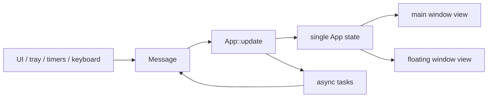

# Native Iced architecture

## Boundaries

`opencode-core` contains the reusable domain layer: the OpenCode dashboard
HTTP client, quota parser, display models, keyring credential access, and pure
threshold evaluation. It has no dependency on the desktop UI.

`opencode-desktop` owns the process lifecycle and presentation:

- `app`, `message`, and `state` implement the single Iced update loop.
- `subscription` translates timers, tray events, keyboard events, and monitor
  ticks into messages.
- `view` renders credentials, dashboard, settings, debug, and floating-window
  content.
- `window` owns main/floating window creation, placement, and drag behavior.
- `platform` isolates system tray and notification adapters.
- `config` validates and atomically persists non-sensitive preferences.

## State flow

Both windows render from the same `UsageState`; no second HTTP client or
monitor is created for the floating window. Blocking keyring operations and
network requests are scheduled as tasks.

## Lifecycle

The process runs as an `iced::daemon`, so it can remain active with no windows.
Closing the main window closes that window while the tray is available. A tray
command recreates it. If tray initialization fails, close exits the process to
avoid an unreachable background process. See ADR 0001 for the decision record.

## Persistence and security

Preferences are validated and stored as JSON below the platform-standard user
configuration directory at `opencode-quota-checker/config.json`. Saves use a
same-directory temporary file, flush, sync, and rename.

The OpenCode `auth` cookie uses the system keyring service
`opencode-quota-checker` and account `opencode-auth`. It is redacted from
`Debug` and is never serialized to the preferences file.

## Cross-platform boundary

CI compiles the native desktop binary on Windows x64, Linux x64, and macOS
Apple Silicon. Release approval additionally requires real installed
package tests for tray lifecycle, notifications, keyring, floating placement,
and desktop-specific indicator behavior.
